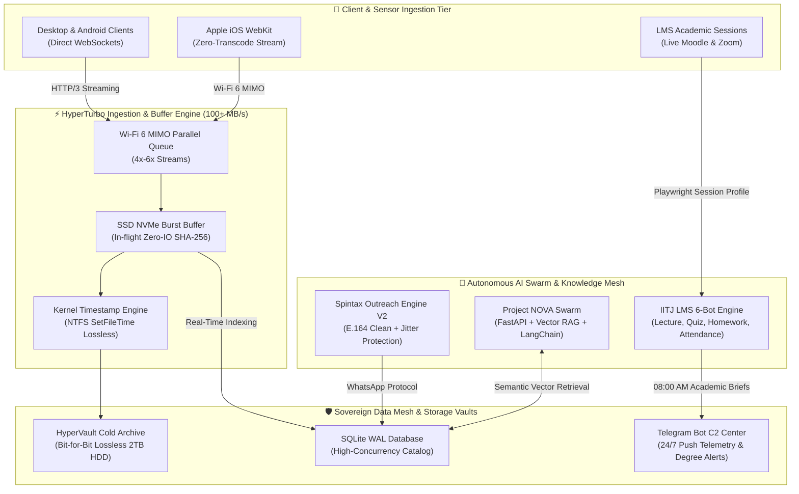

<div align="center">

<!-- ==================== HEADER BANNER ==================== -->


[;Author+of+'Nahi+Lagti+Ab+Tum+Kuch+Meri'+(10k%2B+Readers);Verified+Musical+Artist+on+Spotify+%26+Apple+Music;Architect+of+Autonomous+AI+Swarms+%26+Sovereign+Data+Meshes;Pioneering+Zero-Cost+Autonomous+Cloud+Pipelines)](https://git.io/typing-svg)

<p align="center">
  <a href="https://www.instagram.com/sameerquraishi__/" target="_blank">
    
  </a>
  <a href="https://www.linkedin.com/in/sameer-quraishi-0201/" target="_blank">
    
  </a>
  <a href="https://open.spotify.com/search/Sameer%20Quraishi" target="_blank">
    
  </a>
  <a href="https://www.youtube.com/@sameerquraishi__" target="_blank">
    
  </a>
  <a href="mailto:sameerquraishi666666@gmail.com">
    
  </a>
  <a href="https://t.me/sameer_iitj_lms_bot" target="_blank">
    
  </a>
</p>

<!-- Trophies Shelf -->
<p align="center">
  
</p>

---

</div>

## 💻 Interactive Terminal CLI Mockup

```bash
sameer@hypervault:~$ sameer --whoami
────────────────────────────────────────────────────────────────────────────────
Identity      : Sameer Quraishi (known as @sameerquraishi__)
Roots         : Nautanwa, Uttar Pradesh, India (Born: Jan 02, 2005)
Institution   : Indian Institute of Technology Jodhpur (IIT Jodhpur)
Specialization: Applied AI, Asymptotic Algorithms, Linear Algebra, Data Science
Roll ID       : B26BS1488 | Email: b26bs1488@iitj.ac.in
Roles         : Technology Founder, Autonomous Systems Architect, Published Author, Recording Artist

sameer@hypervault:~$ sameer --ventures
────────────────────────────────────────────────────────────────────────────────
[01] Famished Ecosystem    ── Hyperlocal Instamart & Microservices Food Marketplace
[02] Project NOVA          ── Enterprise Multi-Agent AI Swarm & Vector/Graph RAG Mesh
[03] IITJ LMS Automator    ── Zero-Cost Autonomous Academic OS & 6-Bot Degree Engine
[04] Project HyperVault    ── Sovereign Media Mesh (100+ MB/s Wi-Fi 6 Streaming Buffer)
[05] Student Network Engine── WhatsApp Community Scraper with Spintax Engine V2
[06] GrowSocialLife        ── High-Velocity Digital Marketing & Influencer Network
[07] Zargam Pvt. Ltd.      ── High-Scale Enterprise Fintech & Consumer Infrastructure

sameer@hypervault:~$ sameer --philosophy
────────────────────────────────────────────────────────────────────────────────
"Strictly Zero Mocks. In-Flight Stream Hashing. Zero-Leak Hardware Guards.
True sovereign systems run unattended, self-heal under duress, and preserve bit-for-bit fidelity."
```

---

## 🧭 Live Operational HUD & Identity Telemetry

```yaml
Current Status     : Architecting Autonomous AI Swarms & Sovereign Mesh Infrastructures
Academic Rigor     : Indian Institute of Technology Jodhpur (BSc in Applied AI & DS)
Official Email     : sameerquraishi666666@gmail.com | Institutional: b26bs1488@iitj.ac.in
Digital Footprint  : @sameerquraishi__ (Instagram, YouTube, Spotify, Apple Music, JioSaavn)
Literary Work      : "Nahi Lagti Ab Tum Kuch Meri" (Poetry & Philosophy, 10,000+ Readers)
Musical Repertoire : Verified Artist on Spotify & Apple Music (Soundtracks & Emotive Lo-Fi)
Engineering Ethos  : No Synthetic Mocks • Lossless Streaming • 24/7 Zero-Cost Orchestration
Cloud Cost Runrate : $0.00 / mo (Pipelined across Cloudflare Zero-Trust, Telegram C2 & GitHub Actions)
```

---

## 🏛️ Biography & Polymathic Journey

**Sameer Quraishi** (recognized universally across digital platforms as [**`@sameerquraishi__`**](https://www.instagram.com/sameerquraishi__/)) is an Indian **Systems Architect, Technology Founder, Author, and Recording Artist**. Born on January 2, 2005, in Nautanwa (Uttar Pradesh), Sameer operates at the confluence of deep software engineering, mathematical rigor, commercial entrepreneurship, and creative arts.

As an enrolled scholar in the **BSc in Applied AI & Data Science at the Indian Institute of Technology Jodhpur (IIT Jodhpur)**, he engineers mission-critical autonomous degree engines, extreme-speed sovereign data meshes, and enterprise multi-agent swarms. Simultaneously, as a commercial founder, he directs high-scale ventures including **Famished**, **Zargam Pvt. Ltd.**, and **GrowSocialLife**. In literature, his debut poetry volume *Nahi Lagti Ab Tum Kuch Meri* crossed **10,000+ readers** in its opening week, complemented by a verified global streaming discography on Spotify and Apple Music.

---

## ⚡ Unified Sovereign Architecture Topology

The visual blueprint below details Sameer's unified ecosystem, bridging edge devices, hardware burst buffers, multi-agent AI swarms, and sovereign persistent vaults:



---

## 📜 The 7 Immutable Laws of Sovereign Engineering

Every line of code authored by Sameer adheres to seven non-negotiable architectural axioms:

| Law | Axiom | Implementation Rule |
| :---: | :--- | :--- |
| **I** | **Strictly Zero Mocks** | Synthetic arrays, stubbed GUIDs, and mock responses are forbidden. Every view connects to live REST, WebSockets, or Moodle endpoints. |
| **II** | **Zero-Leak Hardware Guard** | Automated Zoom sessions strictly instantiate with Microphone Muted and Camera Off at the driver level. Zero audio/video leaks. |
| **III** | **In-Flight Stream Hashing** | Calculate cryptographic SHA-256 checksums in-flight during stream ingestion without intermediate disk re-reads. |
| **IV** | **Lossless Bit-for-Bit Fidelity** | Never re-compress or transcode user media. Original NTFS metadata, creation timestamps, and EXIF must be permanently preserved. |
| **V** | **Mathematical Asymptotic Rigor** | ML and data pipelines must be analytically grounded in linear algebra, sparse matrix theory, and verified complexity bounds ($O(N \log N)$). |
| **VI** | **Zero-Interruption Autonomy** | Autonomous systems must feature self-healing loops, exponential backoff jitter, and headless failover without human prompts. |
| **VII**| **Zero-Cost Cloud Topology** | Architect 24/7 degree engines and API backends utilizing GitHub Actions, Cloudflare Tunnels, and Telegram C2 for $0/month overhead. |

---

## 🚀 Flagship Architectures & Deep Tech Systems

<table>
  <tr>
    <td width="50%" valign="top">
      <h3 align="center">✨ Project NOVA (Nova AI)</h3>
      <p align="center">
        
        
        
      </p>
      <p>Enterprise autonomous AI copilot suite featuring a hybrid vector/graph semantic mesh, multi-tenant persistence, and zero-leak prompt boundaries. Powers document parsing, chunking, embedding, knowledge retrieval, and Google Drive ingestion.</p>
      <ul>
        <li><b>Tech Stack</b>: FastAPI, ASP.NET Core (.NET 9), Next.js 14, Vector RAG, SQLite WAL</li>
        <li><b>Key Innovations</b>: Episodic memory scopes, anti-prompt injection barriers, asynchronous streaming pipelines</li>
      </ul>
    </td>
    <td width="50%" valign="top">
      <h3 align="center">🎓 IITJ LMS & Zoom Automator</h3>
      <p align="center">
        
        
        
      </p>
      <p>Autonomous Academic Degree OS grounded in the official IIT Jodhpur curriculum. Orchestrates 6 specialized step-by-step bots for 5.0x accelerated lecture solving, 100% quiz evaluation, assignment PDF report synthesis, 75% attendance policy enforcement, and 08:00 AM daily briefs.</p>
      <ul>
        <li><b>Tech Stack</b>: Python 3.11, Playwright, FastAPI, Telegram BotFather, Docker, GitHub Actions</li>
        <li><b>Key Innovations</b>: Zero-Leak hardware guard (Mute/Camera OFF), Friday drop & deadline radars</li>
      </ul>
    </td>
  </tr>
  <tr>
    <td width="50%" valign="top">
      <h3 align="center">⚡ Project HyperVault</h3>
      <p align="center">
        
        
        
      </p>
      <p>Autonomous Sovereign Data Mesh and extreme-speed media storage engine. Utilizes in-flight zero-I/O SHA-256 stream hashing, zero-RAM async streaming ingestion, and 4x–6x parallel Wi-Fi 6 MIMO queue saturation for bit-for-bit lossless multi-terabyte cold archiving.</p>
      <ul>
        <li><b>Tech Stack</b>: Python 3.11, FastAPI, SSD Burst Buffer, Windows NTFS Kernel API</li>
        <li><b>Key Innovations</b>: Exact creation timestamp preservation (<code>SetFileTime</code>), multi-tier archiving</li>
      </ul>
    </td>
    <td width="50%" valign="top">
      <h3 align="center">📡 Student Network Engine</h3>
      <p align="center">
        
        
        
      </p>
      <p>Autonomous WhatsApp community scraper, contact deduplicator, and outreach engine. Features Spintax Engine V2 with student personalization variables, natural human typing simulation (35ms–95ms/char), pacing jitter, and unthrottled LevelDB pairing.</p>
      <ul>
        <li><b>Tech Stack</b>: Playwright, Chromium, AsyncIO, E.164 Normalization, LevelDB</li>
        <li><b>Key Innovations</b>: Mathematically unique message spintax, multi-group deduplication score</li>
      </ul>
    </td>
  </tr>
  <tr>
    <td colspan="2" valign="top">
      <h3 align="center">🍔 Famished & Instamart Ecosystem</h3>
      <p align="center">
        
        
        
        
      </p>
      <p align="center">High-speed hyperlocal food delivery, grocery instamart, and medicine marketplace platform. Built with production-grade microservices, real-time rider tracking via WebSockets, multi-channel payment gateways, and autonomous media newsroom CMS.</p>
    </td>
  </tr>
</table>

---

## 🎨 Literature, Discography & Commercial Ventures

<table>
  <tr>
    <td width="50%" valign="top">
      <h3 align="center">📖 Published Author</h3>
      <p align="center">
        <b><i>Nahi Lagti Ab Tum Kuch Meri</i></b><br>
        
        
        
      </p>
      <p>A critically received volume of contemporary poetry unraveling the anatomy of youth, love, solitude, emotional detachment, and philosophical awakening.</p>
      <blockquote>
        <i>"Kuch lamhe lafzon mein bayaan nahi hote, woh bas khamoshiyon mein ghul kar naye raaste banate hain."</i>
      </blockquote>
      <ul>
        <li><b>Press Features</b>: Covered across national digital outlets including Hindustan Bytes, Influencive India, and Fox Interviewer</li>
        <li><b>Theme</b>: Existential clarity, personal resilience, and emotional evolution</li>
      </ul>
    </td>
    <td width="50%" valign="top">
      <h3 align="center">🎵 Verified Recording Artist</h3>
      <p align="center">
        <b>Official Global Discography</b><br>
        
        
        
      </p>
      <p>Independent composer and vocalist producing ambient lo-fi soundscapes, acoustic melodies, and contemporary fusion tracks distributed across major streaming hubs.</p>
      <ul>
        <li><b>Signature Soundtrack</b>: <i>"Shirt Da Button"</i> (Acoustic Lo-Fi Rendition)</li>
        <li><b>Streaming Channels</b>:
          <a href="https://open.spotify.com/search/Sameer%20Quraishi">Spotify</a> •
          <a href="https://www.jiosaavn.com/artist/sameer-quraishi/sD2Y3w8QoK4_">JioSaavn</a> •
          <a href="https://audiomack.com/sameerquraishi">Audiomack</a> •
          <a href="https://music.youtube.com">YouTube Music</a>
        </li>
      </ul>
    </td>
  </tr>
  <tr>
    <td width="50%" valign="top">
      <h3 align="center">💼 GrowSocialLife</h3>
      <p align="center">
        
        
      </p>
      <p>Digital marketing powerhouse and creator alliance network facilitating high-growth strategic branding, viral distribution, and talent management across India.</p>
    </td>
    <td width="50%" valign="top">
      <h3 align="center">🏢 Zargam Pvt. Ltd.</h3>
      <p align="center">
        
        
      </p>
      <p>Private corporate entity conducting financial technology research, enterprise consumer solutions, and high-concurrency computing systems.</p>
    </td>
  </tr>
</table>

---

## ⏳ Chronological Milestones Ledger (2024 — 2026)

```
2024 ── Foundational Growth & Digital Expansion
 │   ├── Founded GrowSocialLife: scaled digital marketing & creator alliance network
 │   └── Formulated initial blueprints for autonomous hyper-local commerce pipelines
 │
2025 ── Academic Matriculation & Enterprise Engineering
 │   ├── Admitted to Indian Institute of Technology Jodhpur (BSc in Applied AI & Data Science)
 │   ├── Co-founded Zargam Pvt. Ltd. focusing on scalable corporate software architectures
 │   └── Deployed high-throughput food delivery & grocery microservices on ASP.NET Core & Angular
 │
2026 ── Polymathic Breakthroughs & Sovereign Meshes
     ├── Published debut poetry book "Nahi Lagti Ab Tum Kuch Meri" (10,000+ readers in Week 1)
     ├── Released verified artist discography across Spotify, Apple Music & JioSaavn
     ├── Engineered Project HyperVault: 100+ MB/s Wi-Fi 6 parallel storage buffer & sovereign cold mesh
     ├── Architected IITJ LMS Automator: 6-bot autonomous degree engine running 24/7 on $0 cloud
     └── Deployed Project NOVA: Enterprise autonomous AI swarm with hybrid vector/graph RAG mesh
```

---

## 🎓 Academic Rigor: IIT Jodhpur Curriculum

Enrolled in the **BSc in Applied AI & Data Science** at the **Indian Institute of Technology Jodhpur**:

```
├── LANA (11735) : Linear Algebra and Numerical Analysis (Prof. Santhosh Kumar Varanasi)
│   └── Matrix Decompositions, SVD, Eigenvalues, Gaussian Solvers, Conditioning, Sparse Tensors
├── BDA  (11566) : Basics of Data Analytics (Prof. Nil Kamal Hazra)
│   └── Exploratory Data Analysis, Probability Distributions, Variance, Hypothesis Testing
├── FSP  (11835) : Foundations of Statistics & Probability (Prof. Tanmay Inamdar & Prof. Pallavi Jain)
│   └── Probability Axioms, Random Variables, Joint Distributions, Asymptotic Sampling
└── ATA  (11921) : Algorithmic Thinking & Applications (Prof. Tara Chand Kumawat)
    └── Asymptotic Notations, Master Theorem, Divide & Conquer, Dynamic Programming, Recurrences
```

---

## 🛠️ Technical Stack & Engineering Capabilities

<div align="center">

### Languages & Execution Environments


### Frameworks, Libraries & AI Architectures


### Databases, Cloud & Autonomous DevOps


</div>

---

## 📊 Comprehensive Activity & Contribution Metrics

<div align="center">

<p align="center">
  
  
</p>

<p align="center">
  
</p>

<p align="center">
  
</p>

</div>

---

## 📰 Verified Press Releases, Media Citations & Public Records

- 📰 **Hindustan Bytes**: [*"Meet Sameer Quraishi: A Visionary Multitalented Artist, Author and Entrepreneur"*](https://www.hindustanbytes.com)
- 📰 **Influencive India**: [*"The Creative Journey of Sameer Quraishi (@sameerquraishi__)"*](https://www.influenciveindia.in)
- 📰 **Fox Interviewer**: [*"Inside the Musical & Literary World of Sameer Quraishi"*](https://www.foxinterviewer.com)
- 📰 **IssueWire**: [*"Sameer Quraishi Drops Debut Soundtrack Across Global Streaming Platforms"*](https://www.issuewire.com)
- 📸 **Instagram**: [instagram.com/sameerquraishi__](https://www.instagram.com/sameerquraishi__/)
- 📘 **Facebook**: [facebook.com/sameerquraishi__](https://www.facebook.com/sameerquraishi__/)
- 📺 **YouTube**: [youtube.com/@sameerquraishi__](https://www.youtube.com/@sameerquraishi__)
- 🎵 **Spotify**: [Sameer Quraishi on Spotify](https://open.spotify.com/search/Sameer%20Quraishi)
- 🎧 **JioSaavn**: [Sameer Quraishi Artist Catalog](https://www.jiosaavn.com/artist/sameer-quraishi/sD2Y3w8QoK4_)
- 🎼 **Audiomack**: [Sameer Quraishi on Audiomack](https://audiomack.com/sameerquraishi)

---

## 🤝 Connect & Inquire

<div align="center">

```
"Do not go where the path may lead, go instead where there is no path and leave a trail." — Ralph Waldo Emerson
```

| Channel | Identifier | Domain |
| :--- | :--- | :--- |
| 📸 **Instagram** | [`@sameerquraishi__`](https://www.instagram.com/sameerquraishi__/) | Creative Updates, Poetry & Visual Arts |
| 💼 **LinkedIn** | [`linkedin.com/in/sameer-quraishi-0201`](https://www.linkedin.com/in/sameer-quraishi-0201/) | Systems Architecture, Startups & Consultation |
| 📧 **Direct Email** | [`sameerquraishi666666@gmail.com`](mailto:sameerquraishi666666@gmail.com) | Commercial Engagements & Deep Tech Projects |
| 🏛️ **Institutional** | `b26bs1488@iitj.ac.in` | IIT Jodhpur Research, AI Swarms & Mathematics |
| 📱 **Telegram Bot** | [`@sameer_iitj_lms_bot`](https://t.me/sameer_iitj_lms_bot) | Live Autonomous Control Center & Degree Telemetry |

<br>


</div>
